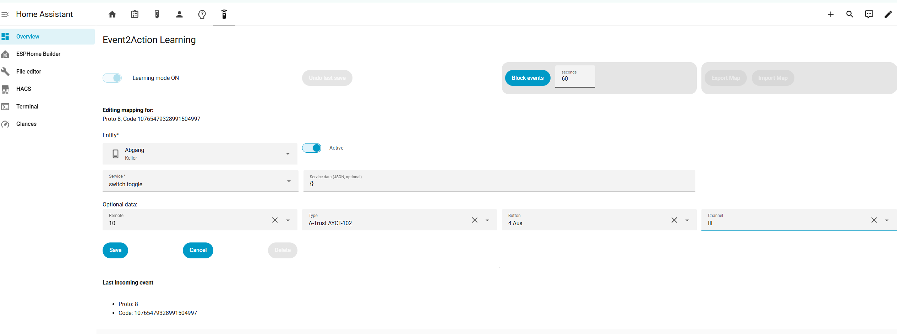

# Disclaimer
Install procedure as HACS custom card was just completed. Pls report any issues. I will try to fix asap.

# Event2Action Mapper for Home Assistant

Event2Action is a Home Assistant editor and runtime for mapping normalized button events to Home Assistant actions. It focuses on the Lovelace learning card, MQTT-backed runtime map storage, helper scripts, and feeder automations for `esphome.rf433` and `zha_event`.

- `esphome.rf433` events are generated by an ESP based RFF433 MHz sniffer [project link](https://github.com/Dschuli/rf433-remote-ha-mapper), which is the also the base for this spin-off project. Project content wil be reduced to just the sniffer.
- `zha_event` events are generated by Zigbee remote scene switches.


For RF433, this project expects Home Assistant to receive `esphome.rf433` events with protocol/code data. For Zigbee buttons, it consumes native `zha_event` payloads. These automations will trigger an `event2action_bus` event, that starts the final event processing (define mapping via learning-card; execute mapped HA action). 

Bring your own event source. Just add another feeder automation, triggered by any event (type) of you choice, eg. an ESPHome based IR reiceiver to act on any button press of an (old) IR remote. All this feeder automation has to do is to fwd an event with a distinctive code/protocol payload. Automation `event2action_zha_feeder` is a good example of how that works, using `ZHA` as protocol, and generating the distinctive code value from the device id + button and action (press, double-press, long-press) info. Then just sending an `event2action_bus` event with this info (+ timestamp and a few other payload fields).

While the main purpose is to reuse existing (old) RF or IR remotes, or. e.g. modern remotes as scene switches, the approach will work with basically any type of event, where the payload can be tranformed into a distinctive code / protocol format.

## Documentation

- **[QUICKSTART.md](QUICKSTART.md)** - Minimal setup path
- **[e2a-mapping-editor-reference.md](e2a-mapping-editor-reference.md)** - Detailed editor features and usage

## Features

- **Event2Action runtime**: one central bus handler executes mapped Home Assistant actions
- **RF433 feeder**: normalizes `esphome.rf433` events into the shared `event2action_bus`
- **ZHA feeder**: normalizes `zha_event` button payloads into the same bus
- **Learning mode**: interactively learn and map incoming event codes
- **Visual editor**: create and edit mappings without hand-editing JSON
- **Backup and undo**: session and step-level backups
- **Import/export**: save and restore mappings as JSON
- **Event blocking**: temporarily suppress action execution while learning
- **MQTT storage**: publish runtime maps and backups through Home Assistant MQTT sensors

## Requirements

- Home Assistant 2024.1 or newer
- MQTT Broker, such as Mosquitto
- Modern web browser for the Lovelace card
- At least one event source:
  - RF433 source that fires Home Assistant events named `esphome.rf433`
  - Zigbee devices using ZHA, which emit `zha_event`

## Installation:

### 1. Home Assistant Package

HACS installs the Lovelace card only. It does not copy the Home Assistant package into your config directory.

From the Home Assistant Terminal/SSH add-on, download the package file into `/config/packages/`:

```bash
mkdir -p /config/packages
wget -O /config/packages/event2action.yaml https://raw.githubusercontent.com/Dschuli/ha-event2action/main/packages/event2action.yaml
```

If your terminal does not have `wget`, use `curl` instead:

```bash
mkdir -p /config/packages
curl -L -o /config/packages/event2action.yaml https://raw.githubusercontent.com/Dschuli/ha-event2action/main/packages/event2action.yaml
```

Make sure package loading is enabled in `configuration.yaml`:

```yaml
homeassistant:
  packages: !include_dir_named packages
```

If you already have a `homeassistant:` section, add only the `packages:` line under it. Restart Home Assistant after adding the package or changing `configuration.yaml`.

### 2. Automations

The package contains three automations:

- `Event2Action RF433 Feeder`: listens for `esphome.rf433`
- `Event2Action ZHA Feeder`: listens for `zha_event`
- `Event2Action Bus Handler`: stores the latest normalized event and runs mapped actions

It also creates the required MQTT sensors, helper entities, and helper script used by the card.

### 3. Dashboard Card

Add the card resource:

```yaml
url: /hacsfiles/ha-event2action/event2action-learning-card.js
type: module
```

Then add the Lovelace card:

```yaml
type: custom:event2action-learning-card
```

Use this card in a dedicated panel view. A panel subview is also a good option if you want to keep Event2Action out of the normal dashboard tab list. `mdi:remote` works well as the view icon.

## Event Source Expectations

### RF433

The RF433 feeder expects events named `esphome.rf433` with data similar to:

```json
{
  "protocol": 1,
  "code": "1234567",
  "pressed": "A"
}
```

`protocol` may also be provided as `proto`. The feeder normalizes these fields into `proto`, `code`, `pressed`, `source`, and `origin_event_type`.

### ZHA

The ZHA feeder listens for `zha_event` and derives a stable code from the device IEEE address, endpoint, and command. It supports short, double, and long press style commands.

## Usage

1. Enable learning mode in the Event2Action card.
2. Press a button or fire a test event.
3. Pick the target entity and service.
4. Save the mapping.
5. Disable learning mode and test the button.



For detailed editor behavior, backup/restore, import/export, and service data examples, see [e2a-mapping-editor-reference.md](e2a-mapping-editor-reference.md).

### Optional Script Targets

Event2Action can call any Home Assistant script. For example, a future companion project named `ha-dimmer-control-by-handheld` could provide a `script.dimmer_control` service target for handheld remote dimming. In that setup, map a learned button to `script.turn_on`, target `script.dimmer_control`, and pass service data such as:

```json
{
  "light_entity": "light.living_room",
  "steps": 5,
  "bounce_at_top": false
}
```

That script is not bundled here; this repository only stores and executes the mapping.

## Testing Without Hardware

Open Home Assistant Developer Tools -> Events and fire an `esphome.rf433` event:

```json
{
  "protocol": 1,
  "code": "111111111",
  "pressed": "test"
}
```

This exercises the RF433 feeder and the shared runtime flow without requiring a physical RF source.

## Configuration

Open the dashboard card configuration editor to customize the user-facing options:

- Supported entity domains
- Custom common service data dropdown entries
- Prefilled service data by entity/service pattern for custom entities, e.g. scripts
- Auto-unblock behavior
- Logging level

Example YAML:

```yaml
type: custom:event2action-learning-card
entity_domain_list:
  - switch
  - light
  - cover
  - script
  - automation
auto_unblock: true
log_level: 2
custom_common_service_data_keys:
  "*dimmer_control|script.turn_on":
    - label: light_entity
      value: light_entity
      default: ""
prefill_service_data:
  "*dimmer_control|script.turn_on": '{"light_entity":" ","steps":5,"bounce_at_top":false}'
```

MQTT sensor names, MQTT topics, and helper entity names remain code-level defaults in `src/e2a-config.js`; most installations should not need to change them.

## Troubleshooting

### No Events Appear

1. In Developer Tools -> Events, listen for `event2action_bus`.
2. Fire or trigger an `esphome.rf433` or `zha_event`.
3. Verify `/config/packages/event2action.yaml` is installed and Home Assistant was restarted.
4. Check that `input_text.event2action_last_event_store` is updated.

### Learning Mode Not Working

1. Verify the required helper entities exist.
2. Verify the MQTT sensors from `packages/event2action.yaml` are present.
3. Check browser console output for card errors.
4. Clear the browser cache after frontend file changes.

### Mappings Not Executing

1. Verify `sensor.event2action_runtime_map` contains a map attribute.
2. Confirm `input_boolean.event2action_block_events` is off.
3. Check the target entity and service still exist.
4. Review the automation trace for `Event2Action Bus Handler`.

## Project Structure

```text
ha-event2action/
├── dist/
│   └── event2action-learning-card.js  # Built Lovelace card loaded by HACS/Home Assistant
├── packages/
│   └── event2action.yaml              # Home Assistant package: helpers, MQTT sensors, scripts, automations
├── src/
│   ├── e2a-learning-card.js           # Main learning card
│   ├── e2a-editor.js                  # Mapping editor UI
│   ├── e2a-card-editor.js             # Lovelace card config editor
│   ├── e2a-config.js                  # Default domains, topics, helpers, editor defaults
│   ├── mixins/                        # Shared card mixins
│   ├── styles/                        # Shared Lit CSS modules
│   └── utils/                         # Utility helpers
├── pictures/                          # README / documentation images
├── hacs.json                          # HACS plugin metadata
├── vite.config.js                     # Build config
├── QUICKSTART.md
└── README.md
```

## License

This project is open source and available under the MIT License.
